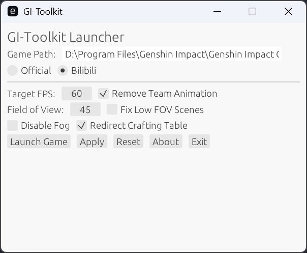

## Genshin Impact Toolkit using MinHook-rs

### Features



### Usage

- Place the `assets` folder in the parent directory of `YuanShen.exe` (the game executable).
- Run `gi-toolkit.exe` from the game directory (where `YuanShen.exe` is located), so the working directory is the game folder and `assets` is its parent.
- **Do not put both `gi-toolkit.exe` and the `assets` folder in the same directory as `YuanShen.exe`, otherwise the game may trigger a file scan and cause issues.**
- For example, if your game is installed at `D:\Program Files\Genshin Impact\Genshin Impact Game\YuanShen.exe`, then put `assets` in `D:\Program Files\Genshin Impact\` and run `gi-toolkit.exe` from `Genshin Impact Game`.
- You can use a batch script like this:

  ```cmd
  @echo off
  cd "D:\Program Files\Genshin Impact\Genshin Impact Game"
  ..\gi-toolkit.exe
  ```

- The above is just an example. The key point is: the `assets` folder must be in the parent directory of your working directory (the directory where you run `gi-toolkit.exe`).
